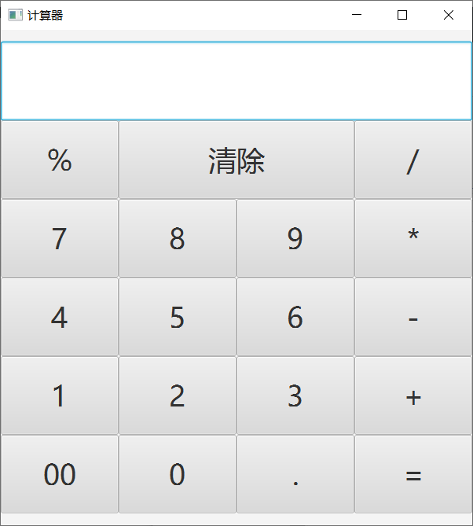

# SimpleCalculator
## 项目介绍

简易计算器。

界面如图：

## 参考链接

[Java实战之简易计算器（1）——项目简述](http://mp.weixin.qq.com/s?__biz=MzU4MDc0NDI0NQ==&mid=2247484048&idx=1&sn=7eb96342668f06d37a33c83ecf2c8cad&chksm=fd5367caca24eedc55e26e9212555123c4ead95ffa3e0dca91de36e81c0a7581d214d268e278&scene=21#wechat_redirect)

[Java实战之简易计算器（2）——安装javafx Scene Builder](http://mp.weixin.qq.com/s?__biz=MzU4MDc0NDI0NQ==&mid=2247484094&idx=1&sn=003625bbb811ee2e09bea1297fc5f642&chksm=fd5367e4ca24eef28eadb24f95d46fa6cb04930bd563648b499dc2a4bb566f8642eb999192b7&scene=21#wechat_redirect)

[Java实战之简易计算器（3）——使用IDEA创建一个JavaFX项目](http://mp.weixin.qq.com/s?__biz=MzU4MDc0NDI0NQ==&mid=2247484095&idx=1&sn=30ee0e04ed362a28a049b889b1929808&chksm=fd5367e5ca24eef30301067f00d6116eaba8ae11d51954ca211eb6684cc8dae8a74c6ab07632&scene=21#wechat_redirect)

[Java实战之简易计算器（4）——实现主界面](http://mp.weixin.qq.com/s?__biz=MzU4MDc0NDI0NQ==&mid=2247484096&idx=1&sn=a440a5d0f2d6e36a855457b43174953c&chksm=fd53679aca24ee8cb713717b7d378338ecef83bc9b4474a508a52f0c2e837c5c3e4f526479bc&scene=21#wechat_redirect)

[Java实战之简易计算器（5）——实现逻辑功能](http://mp.weixin.qq.com/s?__biz=MzU4MDc0NDI0NQ==&mid=2247484097&idx=1&sn=bd6dfe0cabf2151c78bea8e3fdbc7b81&chksm=fd53679bca24ee8dd0ab8a9aa9155438de075f1a84bd90f5f73b44ea1a3a6c13224ff5a6e85b&scene=21#wechat_redirect)